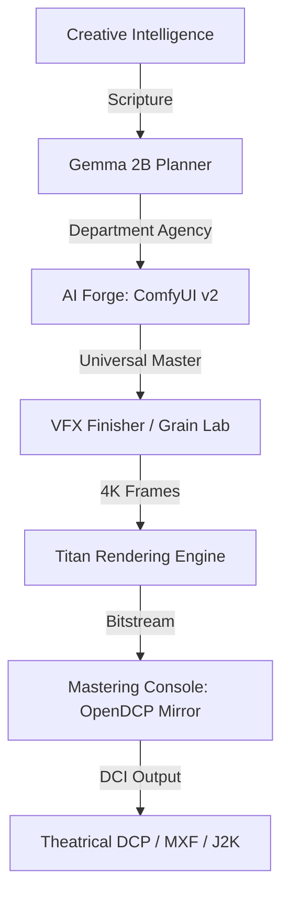

# 🎬 LazyDit: Agentic Cinema Studio & Theatrical Mastering Console

> **The One Studio to Rule the Master.**  
> A professional-grade, theatrical-standard post-production suite powered by Agentic AI and DCI-compliant mastering logic.

---

## 🏗️ System Architecture: The "Titan" Engine

LazyDit is built on the **Titan Chunked Rendering Architecture**, designed for memory-safe, feature-length 4K production.



---

## 🎞️ Core Features

### 🏛️ Professional Cinema Console (Titan Engine)
- **High-Fidelity J2K Engine**: XYZ color-transform compliant JPEG 2000 encoding with automated 12-bit precision.
- **Titan Automated Dispatch**: 6-stage one-click mastering pipeline (Extraction -> Audio -> Subs -> J2K -> MXF -> XML).
- **Direct Subtitle Interop**: Native SRT-to-XML parsing for standard theatrical DCI subtitles.
- **HDR10+ Logic**: Automated detection and preservation of high-dynamic-range metadata (BT.2020/PQ).
- **MXF Wrapper**: Industrial essence wrapping for vision, sound, and timed text.
- **XML Passport**: Automatic CPL, PKL, and ASSETMAP generation for standard cinema projectors.

### 🧠 Agentic AI Forge
- **Universal Master Super-Graph**: A monolithic ComfyUI blueprint chaining Intelligence -> Gen -> VFX -> Mastering.
- **39+ Department Gallery**: One-click autodiscovery of specialized AI blueprints (Wan 2.2, SVD, ACE Audio, etc.).
- **Live Sync**: Direct dashboard-to-engine synchronization for zero-latency department swapping.

### 📐 Engineering Excellence
- **Titan Chunk-and-Stitch**: Memory-safe rendering for large-scale projects.
- **Infrastructure Status Monitoring**: Real-time heartbeat tracking of AI engines and Cinema binaries.
- **Architecture & Academy**: Built-in documentation for professional post-production workflows.

---

## 🚀 Quickstart: Ignition

1. **Launch the Engine**:
   ```pwsh
   python lazydit/comfy_start.py
   ```
2. **Ignite the Studio**:
   ```pwsh
   streamlit run lazydit/app.py
   ```
3. **Select Your Soul**: 
   Navigate to **Asset Forge**, select the **LazyDit Universal Master** from the gallery, and hit **Sync Selected Blueprint**.
4. **Final Master**: 
   Refine your frames in the Forge and dispatch the final bitstream in the **Mastering & Distribution** console.

---

## 🏛️ Project Progress & Roadmap

### Current Status: **V1.1 RELEASE (Cinema Hardened)** 🟢
- [x] Official OpenDCP GUI Reconstruction
- [x] Universal Master Super-Graph Synthesis
- [x] Visual Blueprint Gallery Autodiscovery
- [x] Titan Rendering Architecture Deployment
- [x] Industrial Infrastructure Fault-Tolerance (FFmpeg/Native fallbacks)
- [x] Direct Subtitle Overlay Department (XML-Interop)
- [x] High-Dynamic-Range (HDR10+) Metadata Injection

### Upcoming Roadmap 🏗️
- [ ] Remote Render-Node Clustering (Titan Cloud)
- [ ] Dolby Atmos Audio Essence Integration
- [ ] AI-Driven Color Grading Matcher

---


